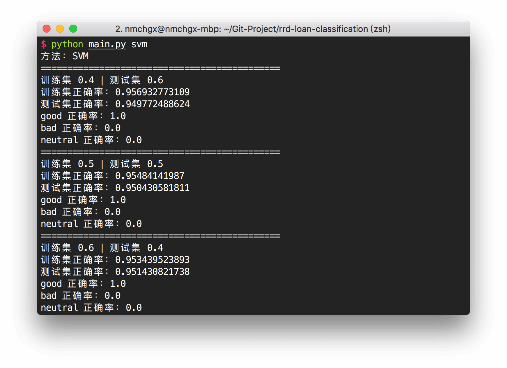
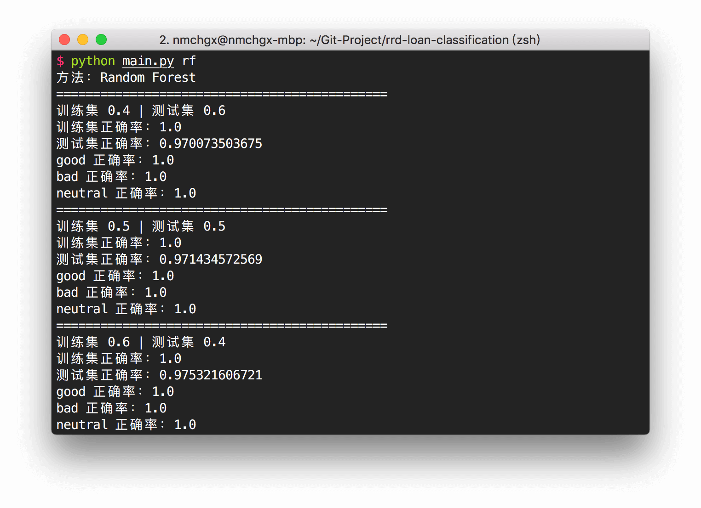

# rrd-loan-forecast

## Dependencies

- Python 2.7

## Install

```bash
pip install -r requirements.txt
```


## Usage

- SVM

```bash
python main.py svm
```


- Random Forest

```bash
python main.py rf
```



